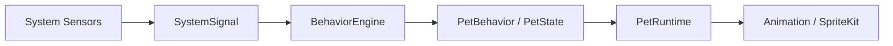

# Architecture

## Overview

JoeyPet splits **system sensing** from **pet presentation**. System code observes macOS; pet code expresses character and animation. Utilities sit behind an explicit safety gate.

## Data flow

```
SystemSensor
    ↓ SystemSignal
BehaviorEngine
    ↓ PetBehavior / PetState
PetRuntime
    ↓ AnimationClip
SpriteKit (render)
```



**Rule:** Sensors never control SpriteKit scenes directly.

## Layers

| Layer | Responsibility | Examples |
|-------|----------------|----------|
| System | Observe macOS, emit signals | `ThermalSensor`, `MemoryPressureSensor` |
| Domain | Types and rules, no UI | `SystemSignal`, `PetState`, `PetBehavior` |
| Behavior engine | Map signals → pet decisions | Priority, cooldown, hysteresis |
| Pet runtime | State machine, clip selection | Minimum duration, interruption, fallback |
| Presentation | Window, panel, sprites | AppKit `NSPanel`, SwiftUI chrome, SpriteKit scene |
| Utilities | User-approved actions | Trash move, folder scan (future phases) |

## UI model (concept)

- **Ambient UI** — pet visible on desktop; minimal chrome.
- **Quiet / non-intrusive** — no spam; batch or defer low-priority cues.
- **Attention budget** — conceptual cap on prompts per time window; no algorithm in V1 docs.

Implementation details: [pet-runtime.md](pet-runtime.md), [system-sensors.md](system-sensors.md).

## Persistence (V1)

User preferences and lightweight state via UserDefaults / `@AppStorage`. No database. See [decisions/004-no-database-in-v1.md](decisions/004-no-database-in-v1.md).

## Testing strategy

- Unit tests for signal → behavior mapping and runtime rules (Swift Testing).
- Manual runtime validation for SpriteKit and window behavior.
- No LLM or external service mocks required in V1.

## Related docs

- [domain-model.md](domain-model.md)
- [tech-stack.md](tech-stack.md)
- [project-structure.md](project-structure.md)
